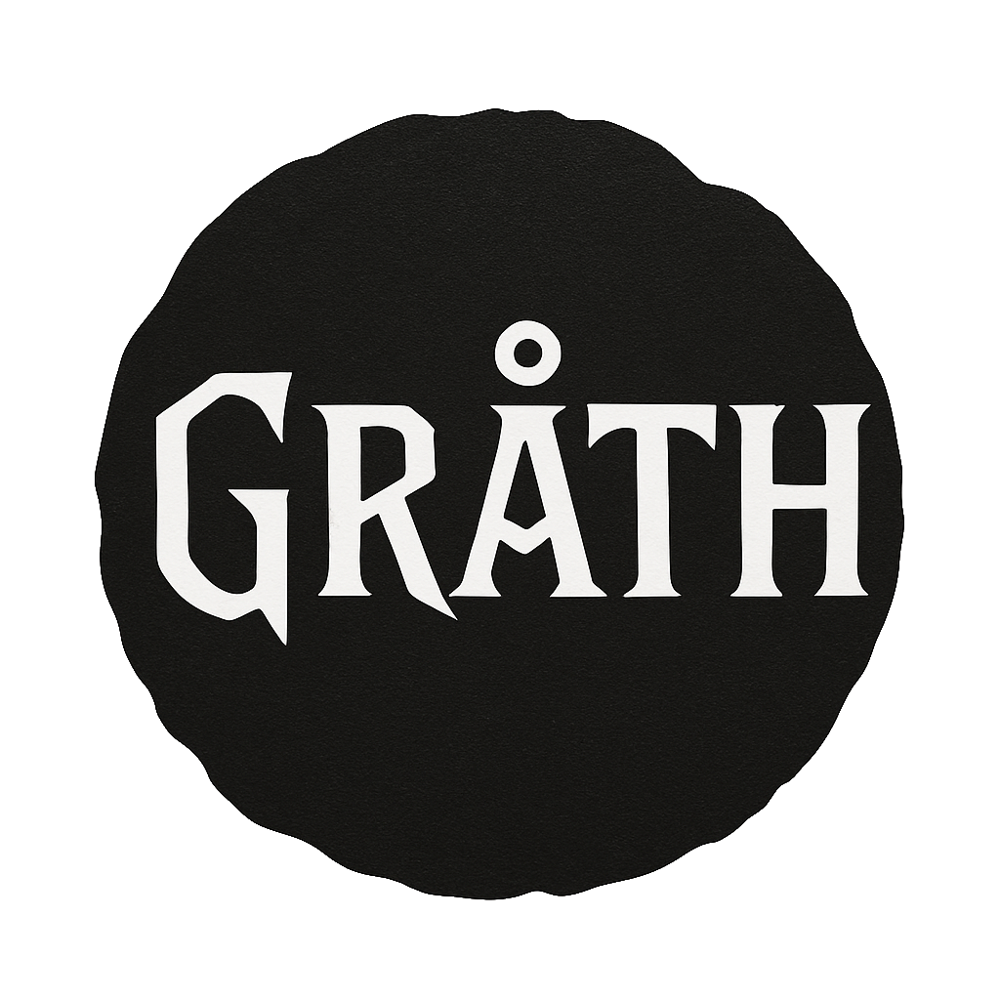

<p align="center">
  
</p>

<p align="center">
  A Rust implementation of the Groth16 zero-knowledge proof system
</p>

# 🚨⚠️ **CRITICAL SECURITY NOTICE** ⚠️🚨

**THIS IS A LEARNING IMPLEMENTATION - NOT FOR PRODUCTION USE!**

This project is an **educational exploration** of the Groth16 zero-knowledge proof system. While it implements the complete protocol, it may lack critical security features and optimizations required for real-world applications.

**For production systems, use established libraries like [arkworks-groth16](https://github.com/arkworks-rs/groth16) or [bellman](https://github.com/zkcrypto/bellman).**
# Overview

Gråth is an implementation of the Groth16 zero-knowledge proof system, built with Rust and the arkworks ecosystem. It provides an abstract trait-based interface which can be instantiated with concrete pairing-friendly curves like BN254 and BLS12-381.


## Architecture

### Core Modules

- **`groth.rs`** - High-level interface using arkworks elliptic curve implementations
- **`linear_proof.rs`** - Core Groth16 protocol implementation (trusted setup, proving, verification)
- **`quadratic_arithmetic_programs.rs`** - QAP implementation with Lagrange interpolation and constraint matrix conversion
- **`basic_pairing.rs`** - Abstract trait definitions for bilinear pairings and group operations
- **`polynomial_from_exponent_vector.rs`** - Polynomial evaluation utilities for precomputed group elements


## Usage Pattern

```rust
use ark_bn254::Bn254;
use grath::*;

// 1. Generate QAP from constraints
let qap = constraint_system_to_qap(constraints);

// 2. Trusted setup (once per circuit)  
let setup = trusted_setup::<Bn254>(&qap);

// 3. Generate proof (per instance)
let proof = prove::<Bn254>(&qap, &witness, &setup);

// 4. Verify proof (public verification)
let valid = verify::<Bn254>(&qap, &public_inputs, &proof, &setup);
```

## Testing and Documentation


Run tests with:
```bash
cargo test
```

Generate documentation with:
```bash
cargo doc --open
```

## License

This project is licensed under the MIT License - see the [LICENSE](LICENSE) file for details.

## Acknowledgments

- Built with the [arkworks](https://arkworks.rs/) ecosystem
- Logo generated by DALL·E for visual appeal
- Inspired by the original [Groth16 paper](https://eprint.iacr.org/2016/260.pdf)
